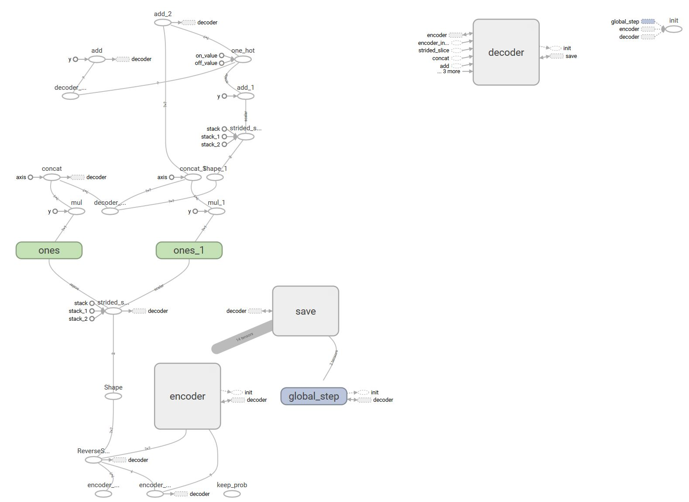

# finnlem

**finnlem** is a [neural network](https://en.wikipedia.org/wiki/Artificial_neural_network) based [lemmatizer](https://en.wikipedia.org/wiki/Lemmatisation) model for [Finnish language](https://en.wikipedia.org/wiki/Finnish_language).

A trained neural network can map given Finnish words into their base form:
```
Original	   Base Form
'koira'    --> 'koira'
'koiran'   --> 'koira'
'koiraa'   --> 'koira'
'koiraksi' --> 'koira'
'koirasta' --> 'koira'
```
The model is a [tensorflow](https://www.tensorflow.org) implementation of a [sequence-to-sequence](https://arxiv.org/abs/1406.1078) recurrent neural network model. 
This repository contains the code and data needed for training and making predictions with the model. The [datasets](src/data/datasets) contain over 2M samples in total.

## Features


* Easy-to-use Python wrappers for sequence-to-sequence modeling
* Automatical session handling, model checkpointing and logging
* Support for tensorboard
* Sequence-to-sequence model features: [Bahdanau](https://arxiv.org/abs/1409.0473) and [Luong](https://arxiv.org/abs/1508.04025) attention, residual connections, dropout, beamsearch decoding, ...

## Installation
You should have the latest versions for (as of 7/2017):
* keras
* nltk
* numpy
* pandas
* tensorflow (1.3.0 or greater, with CUDA 8.0 and cuDNN 6.0 or greater)
* unidecode

After this, clone this repository to your local machine.

## Example usage

### Python

The following is a simple example of using some of the features in the Python API.
See more detailed descriptions of functions and parameters available from the source code documentation.

#### 1. Fit a dictionary with default parameters
```python
from dictionary import Dictionary

# Documents to fit in dictionary
docs = ['abcdefghijklmnopqrstuvwxyz','åäö','DNP','#-']

# Create a new Dictionary object
d = Dictionary()

# Fit characters of each document
d.fit(docs)

# Save for later usage
d.save('./data/dictionaries/lemmatizer.dict')
```

#### 2. Create and train a Seq2Seq model with default parameters
```python
from model_wrappers import Seq2Seq

# Create a new model
model = Seq2Seq(model_dir='./data/models/lemmatizer,
				dict_path='./data/dictionaries/lemmatizer.dict'))

# Create some documents to train on
source_docs = ['koira','koiran','koiraa','koirana','koiraksi','koirassa']*128
target_docs = ['koira','koira','koira','koira','koira','koira','koira']*128

# Train 100 batches, save checkpoint every 25th batch
for i in range(100):
	loss,global_step = model.train(source_docs, target_docs, save_every_n_batch=25)
	print('Global step %d loss: %f' % (global_step,loss))
```
		
#### 3. Make predictions on test set
```python
test_docs = ['koiraa','koirana','koiraksi']
pred_docs = model.decode(test_docs)
print(pred_docs) # --> [['koira'],['koira'],['koira']]
```


### Command line

The following is a bit more complicated example of using the command line to train and predict from files.

#### 1. Fit a dictionary with default parameters
```
python -m dict_train
		--dict-save-path ./data/dictionaries/lemmatizer.dict
		--dict-train-path ./data/dictionaries/lemmatizer.vocab
```
The dictionary train path file(s) should contain one document per line ([example](src/data/dictionaries/lemmatizer.vocab)).

#### 2. Create and train a Seq2Seq model with default parameters
```
python -m model_train
		--model-dir ./data/models/lemmatizer
		--dict-path ./data/dictionaries/lemmatizer.dict
		--train-data-path ./data/datasets/lemmatizer_train.csv
		--validation-data-path ./data/datasets/lemmatizer_validation.csv
		--validate-n-rows 5000
		
python -m model_train ^
		--model-dir ./data/models/lemmatizer ^
		--dict-path ./data/dictionaries/lemmatizer.dict ^
		--train-data-path ./data/datasets/lemmatizer_train.csv ^
		--validation-data-path ./data/datasets/lemmatizer_validation.csv ^
		--validate-n-rows 5000
```
The model train and validation data path file(s) should contain one source and target document per line, 
separated by a comma ([example](src/data/datasets/lemmatizer_validation.csv)).
		
#### 3. Make predictions on test set
```
python -m model_decode ^
		--model-dir ./data/models/lemmatizer ^
		--test-data-path ./data/datasets/lemmatizer_test.csv ^
		--decoded-data-path ./data/decoded/lemmatizer_decoded.csv
```
The model source data path file(s) should contain either:
* one source document per line, or
* one source and target document per line, separated by a comma ([example](src/data/datasets/lemmatizer_test.csv))


## Acknowledgements and references
* [JayParks/tf-seq2seq](https://github.com/JayParks/tf-seq2seq): Example sequence-to-sequence implementation in tensorflow
* [Omorfi](https://github.com/flammie/omorfi): Finnish open source morphology tool
* [FinnTreeBank](http://www.ling.helsinki.fi/kieliteknologia/tutkimus/treebank/): Source for datasets
* [Finnish Dependency Parser](http://bionlp.utu.fi/finnish-parser.html): Source for datasets
		
		