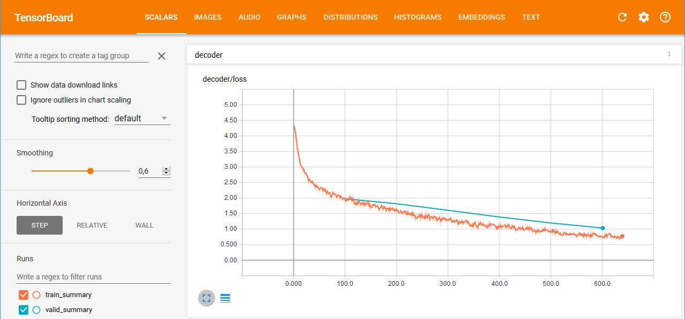

# finnlem

**finnlem** is a [neural network](https://en.wikipedia.org/wiki/Artificial_neural_network) based [lemmatizer](https://en.wikipedia.org/wiki/Lemmatisation) model for [Finnish language](https://en.wikipedia.org/wiki/Finnish_language).

A trained neural network can map given Finnish words into their base form with quite reasonable accuracy. These are examples of the model output:
```
[ORIGINAL] --> [BASE FORM]
Kiinalaisessa --> kiinalainen
osinkotulojen --> osinko#tulo	
Rajoittavalla --> rajoittaa
multimediaopetusmateriaalia -->	multi#media#opetus#materiaali
ei-rasistisella	--> ei-rasistinen
```
The model is a [tensorflow](https://www.tensorflow.org) implementation of a [sequence-to-sequence](https://arxiv.org/abs/1406.1078) (Seq2Seq) recurrent neural network model. 
This repository contains the code and data needed for training and making predictions with the model. The [datasets](src/data/datasets) contain over 2M samples in total.

## Features

* Easy-to-use Python wrapper for sequence-to-sequence modeling
* Automatical session handling, model checkpointing and logging
* Support for tensorboard
* Sequence-to-sequence model features: [Bahdanau](https://arxiv.org/abs/1409.0473) and [Luong](https://arxiv.org/abs/1508.04025) attention, residual connections, dropout, beamsearch decoding, ...

## Installation
You should have the latest versions for (as of 7/2017):
* keras
* nltk
* numpy
* pandas
* tensorflow (1.3.0 or greater, with CUDA 8.0 and cuDNN 6.0 or greater)
* unidecode
* sacremoses ([see issue regarding this](https://github.com/jmyrberg/finnlem/issues/1))

After this, clone this repository to your local machine.

Update 10.9.2020: You could also try to first clone and then run `pip install -r requirements.txt` at the root of this repository. This will install the latest versions of the required packages automatically, but notice that the very latest versions of some of the packages might nowadays be incompatible with the source code provided here. Feel free to make a pull request with fixed versions of the packages, in case you manage to run the source code successfully :)

## Example usage

Three-steps are required in order to get from zero to making predictions with a trained model:

1. **Dictionary training**: Dictionary is created from training documents, which are processed the same way as the Seq2Seq model inputs later on.
	Dictionary handles vocabulary/integer mappings required by Seq2Seq.
2. **Model training**: Seq2Seq model is trained in batches with training documents that contain source and target.
3. **Model decoding**: Unseen source documents are fed into Seq2Seq model, which makes predictions on the target.

### Python ([See list of relevant Python API classes](doc/python_api.md))

The following is a simple example of using some of the features in the Python API.
See more detailed descriptions of functions and parameters available from the source code documentation.

#### 1. Dictionary training - fit a dictionary with default parameters
```python
from dictionary import Dictionary

# Documents to fit in dictionary
docs = ['abcdefghijklmnopqrstuvwxyz','åäö','@?*#-']

# Create a new Dictionary object
d = Dictionary()

# Fit characters of each document
d.fit(docs)

# Save for later usage
d.save('./data/dictionaries/lemmatizer.dict')
```

#### 2. Model training - create and train a Seq2Seq model with default parameters
```python
from model_wrappers import Seq2Seq

# Create a new model
model = Seq2Seq(model_dir='./data/models/lemmatizer,
				dict_path='./data/dictionaries/lemmatizer.dict')

# Create some documents to train on
source_docs = ['koira','koiran','koiraa','koirana','koiraksi','koirassa']*128
target_docs = ['koira','koira','koira','koira','koira','koira']*128

# Train 100 batches, save checkpoint every 25th batch
for i in range(100):
	loss,global_step = model.train(source_docs, target_docs, save_every_n_batch=25)
	print('Global step %d loss: %f' % (global_step,loss))
```
		
#### 3. Model decoding - make predictions on test data
```python
test_docs = ['koiraa','koirana','koiraksi']
pred_docs = model.decode(test_docs)
print(pred_docs) # --> [['koira'],['koira'],['koira']]
```


### Command line ([See list of available commands here](doc/commands.md))

The following demonstrates the usage of command line for training and predicting from files.

#### 1. Dictionary training - fit a dictionary with default parameters
```
python -m dict_train
		--dict-save-path ./data/dictionaries/lemmatizer.dict
		--dict-train-path ./data/dictionaries/lemmatizer.vocab
```
The dictionary train path file(s) should contain one document per line ([example](src/data/dictionaries/lemmatizer.vocab)).

#### 2. Model training - create and train a Seq2Seq model with default parameters
```
python -m model_train
		--model-dir ./data/models/lemmatizer
		--dict-path ./data/dictionaries/lemmatizer.dict
		--train-data-path ./data/datasets/lemmatizer_train.csv
```
The model train and validation data path file(s) should contain one source and target document per line, 
separated by a comma ([example](src/data/datasets/lemmatizer_validation.csv)).
		
#### 3. Model decoding - make predictions on test data
```
python -m model_decode
		--model-dir ./data/models/lemmatizer
		--test-data-path ./data/datasets/lemmatizer_test.csv
		--decoded-data-path ./data/decoded/lemmatizer_decoded.csv
```
The model test data path file(s) should contain either:
* one source document per line, or
* one source and target document per line, separated by a comma ([example](src/data/datasets/lemmatizer_test.csv))

## Extensions
* To use tensorboard, run command ```python -m tensorflow.tensorboard --logdir=model_dir```, 
where ```model_dir``` is the Seq2Seq model checkpoint folder.
* The model was originally created for summarizing the Finnish news, by using news contents as the sources, and news titles as the targets.
This proved to be quite a difficult task due to rich morphology of Finnish language, and lack of computational resources. My first
approach for tackling the morphology was to use the base forms for each word, which is what the model in this package does by default. However, 
using this model to convert every word to their base form ended up being too slow to be used as an input for the second model in real time.

	In the end, I decided to try the [Finnish SnowballStemmer from nltk](http://www.nltk.org/_modules/nltk/stem/snowball.html) in order to get the "base words", 
	and started training the model with 100k vocabulary. After 36 hours of training with loss decreasing very slowly, I decided to stop, and keep this package as a character-level lemmatizer.
	However, in [model_wrappers.py](src/model_wrappers.py), there is a global variable *DOC_HANDLER_FUNC*, which enables one to change the preprocessing method easily from
	characters to words by setting ```DOC_HANDLER_FUNC='WORD'```. Try changing the variable, and/or write your own preprocessing function *doc_to_tokens*, if you'd like to 
	experiment with the word-level model.


## Acknowledgements and references
* [JayParks/tf-seq2seq](https://github.com/JayParks/tf-seq2seq): Example sequence-to-sequence implementation in tensorflow
* [Omorfi](https://github.com/flammie/omorfi): Finnish open source morphology tool
* [FinnTreeBank](http://www.ling.helsinki.fi/kieliteknologia/tutkimus/treebank/): Source for datasets
* [Finnish Dependency Parser](http://bionlp.utu.fi/finnish-parser.html): Source for datasets
		
---
Jesse Myrberg (jesse.myrberg@gmail.com)